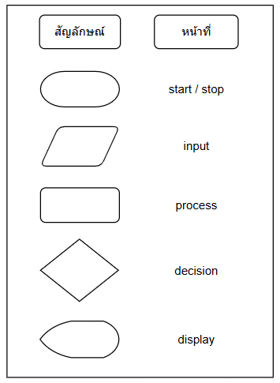
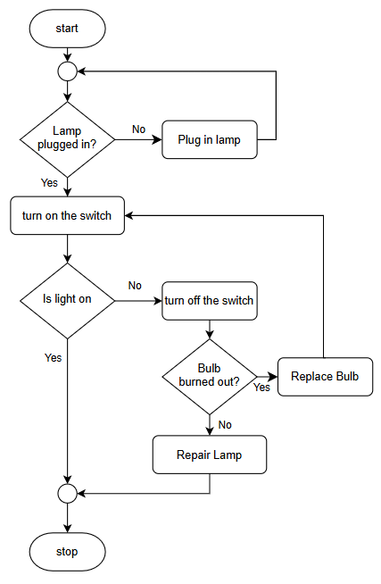
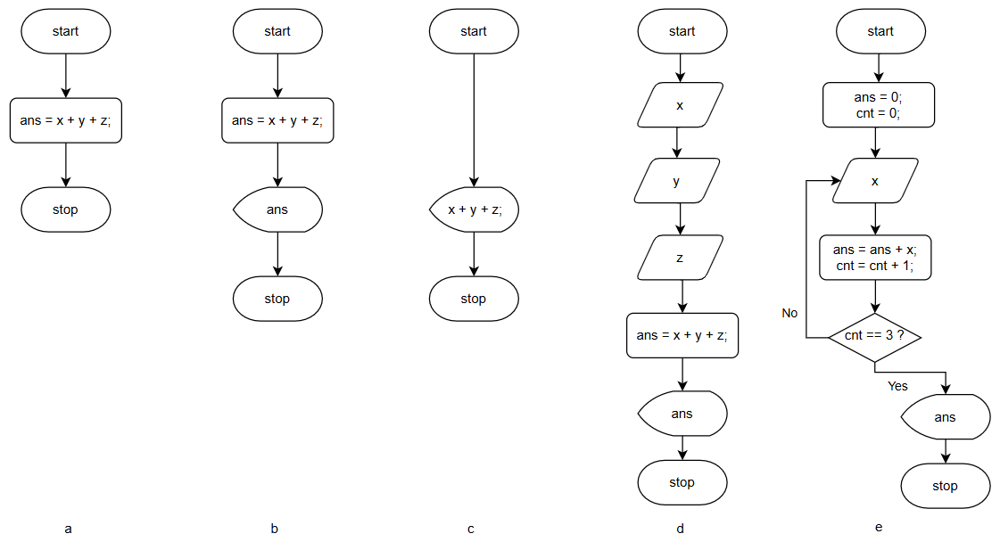

chapter 1

เนื้อหาของ fundamental programming เราจะเริ่มที่กลุ่มของไวยากรณ์ตามหลักภาษา structure programming (ภาษาในกลุ่มที่มีมาก่อน Object Oriented programming หรือ Funcional Programming ที่เป็นที่นิยมในปัจจุบัน) เนื่องจากผู้เขียนยังเห็นความสำคัญในการนำความรู้ส่วนนี้ไปใช้สำหรับกลุ่มเนื้อหาเชิง low level 

โดยทั่่วไปกลุ่มไวยากรณ์หลัก
(1.) การทำงานตามลำดับ (sequential) 
(2.) การตัดสินใจ (decision)
(3.) การทำซ้ำ (iteration)

นอกจากนี้ structure programming ใช้คอนเซ็ปต์ (4.) block ในการมัดคำสั่งให้เป็นกลุ่มเดียวกัน และในการเขียนโปรแกรมจะมีการใช้ (5.) comment เพื่อใส่คำอธิบาย code หรือเพื่อการใด ๆ 

นอกจากกลุ่มไวยากรณ์แล้ว การเขียนโปรแกรมจะเก็บข้อมูล(ที่ถูกนำไปประมวลผล)ไว้ในสิ่งที่เรียกว่า ตัวแปร (variable)

ก่อนจะกล่าวถึงไวยากรณ์ทั้ง 5 แบบที่กล่าวมาแล้ว ผู้เขียนอยากให้มีความคุ้นเคยกับความหมายของโปรแกรมด้วยเครื่องมือสองชิ้นได้แก่ `ผังงาน` (flowchart) และ `รหัสเทียม` (pseudocode) ดังต่อไปนี้

`ผังงาน` เป็นเครื่องมือแสดงกระบวนการทำงานตั้งแต่ต้นจนจบ ในทางการเขียนโปรแกรมเครื่องมือนี้เหมาะสำหรับพื้นฐานการเขียนโปรแกรมที่ไม่มีกระบวนการที่ซับซ้อน สัญลักษณ์ที่เราจะใช้ 5 สัญลักษณ์ เริ่มต้น/สิ้นสุด (start/stop) อินพุต (input) ประมวลผล (process) การตัดสินใจ (decision) และ การแสดงผล (display)  ดังแสดง

 

สังเกตว่าไม่ได้ตรงกับกลุ่มไวยากรณ์ตรง ๆ (ตรงเฉพาะ decision) แต่ความคาใจนี้น่าจะหมดไปเมื่อเข้าใจลักษณะการทำงานของโปรแกรมในลำดับถัด ๆ ไป ในการอธิบายสัญลักษณ์ทั้ง 5 กลุ่ม เราจะเริ่มที่ตัวอย่าง<ins>ขั้นตอนวิธี</ins>การใช้โคมไฟดังต่อไปนี้ 

 

ภาพ a แสดงการใช้งาน start/stop กล่าวคือ ทุกโปรแกรมจะมีตำแหน่งเริ่มต้นและสิ้นสุดการทำงานเพื่อความชัดเจน การทำงานตามลำดับ (อย่างเพิ่งงง ...คือคำสั่งใด ๆ ที่ไม่ใช่ การตัดสินใจ หรือ การทำซ้ำ) คือการประมวลผล กล่าวคือ บอกแค่ให้เสียบปลั๊ก

ภาพ b จะเห็นการทำงานตามลำดับที่ชัดกว่า กล่าวคือ การประมวลผลแต่ละคำสั่งจะเป็นไปตามลำดับ 

เราสามารถขยายความสมบูรณ์ของขั้นตอนวิธีการใช้โคมไฟให้ครอบคลุมขึ้นดังต่อไปนี้ 

 

เราคาดหวังว่าหากเปิดใช้งานมีปัญหาขั้นตอนวิธีนี้จะช่วยให้ผู้ใช้โปรแกรมได้ใช้โคมไฟ อย่างไรก็ดีความหมายของโปรแกรมนี้คือ 

ถ้าไม่ได้เสียบปลั๊ก -> เสียบปลั๊ก

ถ้า(ปลั๊กเสียบอยู่แล้ว)พบว่าหลอดไฟขาด -เปลี่ยนหลอดไฟ

เราตีความมากกว่านั้นไม่ได้เลย เพราะคอมพิวเตอร์ทำงานเฉพาะเท่าที่สั่งมา กล่าวคือโปรแกรมนี้ก็ไม่ได้สมบูรณ์ เช่น หากเปิดติดควรทำอะไร (ไปที่จุดสิ้นสุด) หากเสียบปลั๊กแล้วควรไปทดสอบเปิดก่อนใช่หรือไม่ แต่ทั้งนี้ตัวอย่างนี้ก็เพียงแนะนำความหมายของการตัดสินใจว่าการกระทำนั้นจะได้ค่า จริง/เท็จ เพื่อเลือกเส้นทางการประมวลผล 

บางทีขั้นตอนวิธีการใช้โคมไฟดังภาพต่อไปนี้อาจดูครบถ้วนขึ้น 

เราจะแสดงการใช้ผังงานสำหรับตัวอย่างโปรแกรมหาผลรวมของค่า 3 ค่า ดังต่อไปนี้ 

ภาพ a เป็นการประมวลผลตรง ๆ (หากจะกล่าวรายละเอียด คณิตศาสตร์ทางคอมพิวเตอร์ เราคำนวณทางขวามาเก็บในตัวแปรทางซ้าย ไม่ใช่การแสดงว่าเท่ากัน ดังนั้น เราจะไม่เขียน x + y + z = ans) ภาพ b
แสดงการใชัสัญลักษณ์ display กล่าวคือ การประมวลผลเกิดขึ้นภายในคอมพิวเตอร์ ไม่มีการแสดงผลทางหน้าจอ ดังนั้นเราเลือกแสดงผลเฉพาะค่าที่จะแสดง ภาพ c หากเราไม่ต้องการเก็บ ans ไปใช้ที่อื่นอีก ย่อมสามารถแสดงผลโดยไม่ต้องใช้ตัวแปรเพิ่ม แต่ถือว่าโปรแกรมอ่านยากขึ้น

คำถามคือแล้ว x y z มีค่าเป็นอะไร จึงต้องมีสัญลักษณ์ input สำหรับกำหนดค่าที่ต้องการคำนวณดังภาพ d 

หลายปัญหา (โปรแกรม) เราสามารถมีขั้นตอนวิธีมากกว่า 1 วิธี ตัวอย่างนี้ก็เช่นกัน กล่าวคือ ภาพ e เราสามารถใช้การทำซ้ำวนรับค่าให้ตัวแปร x 3 รอบ (หรือ n รอบ) โดยต้องสะสมค่าไว้ก่อน ซึ่งมีประเด็นให้กล่าวถึงดังต่อไปนี้ 1. ไวยากรณ์การทำซ้ำ (จะกล่าวถึงในลำดับถัดไป) ต่างจากการตัดสินใจ ตรงที่มีค่าเริ่มต้น มีจุดตัดสินใจที่จะเลิกทำซ้ำ มีการแปลงค่าเริ่มต้นเพื่อให้ไปสู่การเลิกทำซ้ำ ทำให้สามารถเขียนโปรแกรมได้ง่ายขึ้นในกรณีมีการประมวลผลมีลักษณะการทำซ้ำ ในกรณีของผังงานเราใช้วิธีย้อนกลับขึ้นไปยังสัญลักษณ์ก่อนหน้า จุดสังเกตอีกประการหนึ่งคือภาพ e นั้นเราต้องตั้งค่า ans และ cnt ก่อนสะสมค่า เพื่อความชัดเจนว่ามีค่าเริ่มต้นเป็น 0 2. หากรับค่า n ด้วย (แทน cnt == 3 ด้วย n) เราสามารถใช้โปรแกรมนี้สะสมค่า n ค่า ซึ่งถือว่ายืดหยุ่นกว่าการเขียนแบบ d 
`รหัสเทียม` เป็นการเขียนขั้นตอนวิธี ขั้นตอนวิธีที่เขียนนั้นสามารถนำไปแปลงเป็นโค้ดได้ ดังนั้นรหัสเทียมสามารถเป็นได้ตั้งแต่ภาษามนุษย์ จนถึงภาษาที่นิยมอย่าง C-like (ใช้ไวยากรณ์คล้ายภาษาซี) เราใช้โปรแกรมหาผลรวมค่า 3 ค่าดังต่อไปนี้

| Line |Pseudocode for Summation of 3 Values | C-like Code |
|-|-------------------------------------|-----------------|
| 1 |- Start                              |                 |        
| 2 |- Input value for `x`                | input x;                |
| 3 |- Input value for `y`                | input y;                |
| 4 |- Input value for `z`                | input z;                |
| 5 |- Set `sum = a + b + c`              | ans = x + y + z;        |
| 6 |- Display `sum`                      | print(ans);             |
| 7 |- End                                |                 |

เราจะกล่าวถึงไวยากรณ์ C-like เฉพาะดังต่อไปนี้ เรียกประโยคในโปรแกรมว่า statement จบด้วยสัญกร ;  ประโยคที่ไม่ใช่ไวยากรณ์การตัดสินใจ การทำซ้ำ คือประโยคการทำงานตามลำดับ (บรรทัดที่ 2 - 6) 

แบบฝึกหัด
1. (A1-004) เขียนผังงานรับค่า 3 ค่า (คะแนนเก็บ (ไม่เกิน 10) คะแนนสอบกลางภาค (ไม่เกิน 40) และคำแนนสอบปลายภาค (ไม่เกิน 50)) หากผลรวมคะแนนมีค่าไม่ถึง 50 ให้แสดงผลลัพธ์ "fail" ไม่เช่นนั้นให้แสดงผลลัพธ์ "pass"
2. (A1-019) เขียนผังงานวนรับค่า 3 ค่า หากค่าทั้ง 3 เป็นค่าเดียวกันให้แสดงผลลัพธ์ "same" ไม่เช่นนั้นให้แสดงผลลัพธ์ "different"

