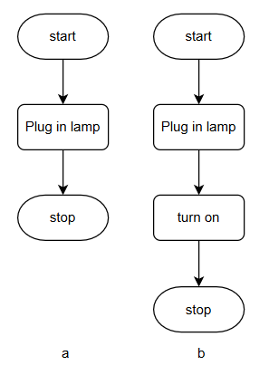
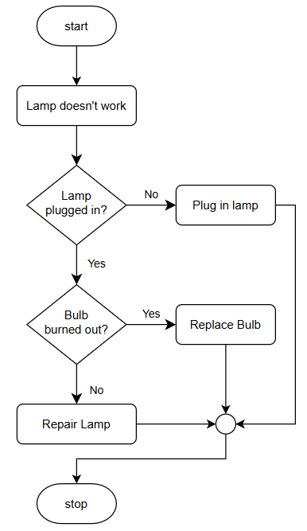

chapter 1

เนื้อหาของ fundamental programming เราจะเริ่มที่กลุ่มของไวยากรณ์ตามหลักภาษา structure programming (ภาษาในกลุ่มที่มีมาก่อน Object Oriented programming หรือ Funcional Programming ที่เป็นที่นิยมในปัจจุบัน) เนื่องจากผู้เขียนยังเห็นความสำคัญในการนำความรู้ส่วนนี้ไปใช้สำหรับกลุ่มเนื้อหาเชิง low level 

โดยทั่่วไปกลุ่มไวยากรณ์หลัก
(1.) การทำงานตามลำดับ (sequential) 
(2.) การตัดสินใจ (decision)
(3.) การทำซ้ำ (iteration)

นอกจากนี้ structure programming ใช้คอนเซ็ปต์ (4.) block ในการมัดคำสั่งให้เป็นกลุ่มเดียวกัน และในการเขียนโปรแกรมจะมีการใช้ (5.) comment เพื่อใส่คำอธิบาย code หรือเพื่อการใด ๆ 

นอกจากกลุ่มไวยากรณ์แล้ว การเขียนโปรแกรมจะเก็บข้อมูล(ที่ถูกนำไปประมวลผล)ไว้ในสิ่งที่เรียกว่า ตัวแปร (variable)

ก่อนจะกล่าวถึงไวยากรณ์ทั้ง 5 แบบที่กล่าวมาแล้ว ผู้เขียนอยากให้มีความคุ้นเคยกับความหมายของโปรแกรมด้วยเครื่องมือสองชิ้นได้แก่ `ผังงาน` (flowchart) และ `รหัสเทียม` (pseudocode) ดังต่อไปนี้

`ผังงาน` เป็นเครื่องมือแสดงกระบวนการทำงานตั้งแต่ต้นจนจบ ในทางการเขียนโปรแกรมเครื่องมือนี้เหมาะสำหรับพื้นฐานการเขียนโปรแกรมที่ไม่มีกระบวนการที่ซับซ้อน สัญลักษณ์ที่เราจะใช้ 5 สัญลักษณ์ เริ่มต้น/สิ้นสุด (start/stop) อินพุต (input) ประมวลผล (process) การตัดสินใจ (decision) และ การแสดงผล (display)  ดังแสดง

 

สังเกตว่าไม่ได้ตรงกับกลุ่มไวยากรณ์ตรง ๆ (ตรงเฉพาะ decision) แต่ความคาใจนี้น่าจะหมดไปเมื่อเข้าใจลักษณะการทำงานของโปรแกรมในลำดับถัด ๆ ไป ในการอธิบายสัญลักษณ์ทั้ง 5 กลุ่ม เราจะเริ่มที่ตัวอย่าง<ins>ขั้นตอนวิธี</ins>การใช้โคมไฟดังต่อไปนี้ 

 

ภาพ a แสดงการใช้งาน start/stop กล่าวคือ ทุกโปรแกรมจะมีตำแหน่งเริ่มต้นและสิ้นสุดการทำงานเพื่อความชัดเจน การทำงานตามลำดับ (อย่างเพิ่งงง ...คือคำสั่งใด ๆ ที่ไม่ใช่ การตัดสินใจ หรือ การทำซ้ำ) คือการประมวลผล กล่าวคือ บอกแค่ให้เสียบปลั๊ก

ภาพ b จะเห็นการทำงานตามลำดับที่ชัดกว่า กล่าวคือ การประมวลผลแต่ละคำสั่งจะเป็นไปตามลำดับ 

เราสามารถขยายความสมบูรณ์ของขั้นตอนวิธีการใช้โคมไฟให้ครอบคลุมขึ้นดังต่อไปนี้ 

 

เราคาดหวังว่าหากเปิดใช้งานมีปัญหาขั้นตอนวิธีนี้จะช่วยให้ผู้ใช้โปรแกรมได้ใช้โคมไฟ อย่างไรก็ดีความหมายของโปรแกรมนี้คือ 

ถ้าไม่ได้เสียบปลั๊ก -> เสียบปลั๊ก

ถ้า(ปลั๊กเสียบอยู่แล้ว)พบว่าหลอดไฟขาด -เปลี่ยนหลอดไฟ

เราตีความมากกว่านั้นไม่ได้เลย เพราะคอมพิวเตอร์ทำงานเฉพาะเท่าที่สั่งมา กล่าวคือโปรแกรมนี้ก็ไม่ได้สมบูรณ์ เช่น หากเปิดติดควรทำอะไร (ไปที่จุดสิ้นสุด) หากเสียบปลั๊กแล้วควรไปทดสอบเปิดก่อนใช่หรือไม่ แต่ทั้งนี้ตัวอย่างนี้ก็เพียงแนะนำความหมายของการตัดสินใจว่าการกระทำนั้นจะได้ค่า จริง/เท็จ เพื่อเลือกเส้นทางการประมวลผล 

