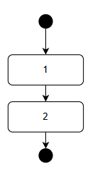
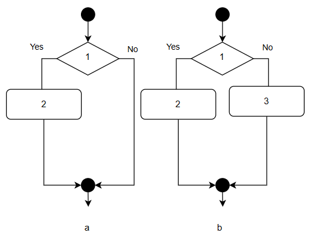
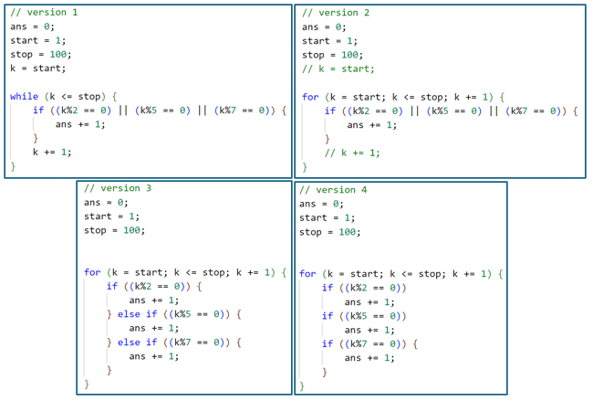

## chapter 2

เราจะพิจารณา ไวยากรณ์ 5 กลุ่มหลัก 

1. sequential เป็นการทำงานตามลำดับ  
2. decision เป็นการประมวลผลที่ให้ค่า จริง/เท็จ   
3. iteration เป็นการวนกลับขึ้นไปตามเงื่อนไข   
4. block เป็นการมัดคำสั่งให้เป็นกลุ่มเดียวกัน 
5. comment เพื่อใส่คำอธิบาย code หรือเพื่อการใด ๆ

### sequential (และ commment)

 

- assignment statement

statement ทั่วไป ใช้ operator = ในการตำนวณ (ดังที่กล่าวไปแล้วว่าจบประโยคด้วย ;) เรียกประโยคเหล่านี้ว่า assignment statement สำหรับการให้ค่าที่คำนวณได้ทางขวาไปเก็บไว้ที่ตัวแปรทางซ้าย

เราคุ้นเคยกับ operator + - * / มี operator 1 ตัวที่เราอาจใหม่สำหรับผู้ไม่เคยเขียนโปรแกรมนั่นคือ % (modulo) ซึ่งเป็นการหารเอาเศษ (mod)

เราจะใช้รหัสเทียมต่อไปนี้อธิบาย statement ธรรมดา (ไม่ใช่ decision หรือ iteration) ในกรณีของรหัสเทียม เราสามารถไม่สนว่าต้องประกาศตัวแปรหรือไม่ เนื่องจากต้องการโฟกัสไปที่ลำดับการประมวลผลของ***ขั้นตอนวิธี*** แต่ในกลุ่มของภาษาที่เราสนใจเราจะประกาศตัวแปรที่เราใช้พร้อม type ของตัวแปรนั้นจึงนำมาประกอบตัวอย่างนี้ด้วย แต่ก่อนเรื่องนั้นเราจะอธิบาย comment ณ ที่นี้ 

| line | C-like code |
|-------|-----------------|
| /\*0\*/ | /* ans represents x mod y  */                           |
| /\*1\*/ | `int x;`                                                |
| /\*2\*/ | `x = 11;`                                               |
| /\*3\*/ | `int y = 5; // short-cut initialization of y`           |
| /\*4\*/ | `int ans = 0;`                                          |
| /\*5\*/ | `ans = x % y; // ans is 1`                              |

- comment

ตัวอย่างนี้แสดงนอกจากแสดง assignment statement ที่บรรทัดที่ 5 แล้ว ยังแสดงการใช้งาน comment โดยสิ่งทีพิมพ์ที่นับเป็น comment จะไม่นับเป็นส่วนหนึ่งของโปรแกรมสำหรับการทำงาน จึงใช้เป็นพื้นที่สำหรับนักพัฒนาโปรแกรมใช้อธิบายส่วนต่างๆที่นักพัฒนาเขียน ไวยากรณ์การสร้าง comment มี 2 รูปแบบเรียกว่า multi-line comment (/\* \*/) และ line comment (//)  

multi-line comment หมายถึงคำใดก็ตามที่พิมพ์ระหว่างสัญลักษณ์ /\* \*/ ไม่นับเป็นส่วนหนึ่งของโค้ด สามารถพิมพ์ยาวเท่าไหร่ก็ได้หลังจากสัญลักษณ์ /\* จนกว่าตัวแปลภาษาจะพบ \*/ กล่าวคือยาวกี่บรรทัดก็ได้ จึงเรียกเช่นนี้ ในที่นี้ผู้เขียนจึงนำมาใช้แสดงเลขที่บรรทัด เพื่อความง่ายในการอธิบาย

line comment ใช้สัญลักษณ์ // คำใดก็ตามที่ตามหลังสัญลักษณ์นี้ไม่นับเป็นส่วนหนึ่งของโค้ด ดังตัวอย่างบรรทัดที่ 3 

- variable declaration

รหัสเทียมมักไม่เห็นคำสั่งแสดงผลในรหัสเทียม (เราอาจเอาค่าที่คำนวณได้ไปทำขั้นตอนอื่นต่อไป) เพื่อเป็นการยกตัวอย่าง sequential statement แบบอื่น จึงนำไวยากรณ์การประกาศตัวแปรมาแสดง ณ ที่นี้ 

ตัวแปรหมายถึงตำแหน่งบนหน่วยความจำหลัก ซึ่งเก็บค่าที่เราต้องการใช้ ทำให้สามารถอ้างถึงตำแหน่งนั้นด้วยชื่อของมันแทนที่จะต้องรู้ว่าตำแหน่งนั้นคือตำแหน่งอะไร ค่าบนตำแหน่งนั้น ๆ ในแต่ละ type มีความหมายต่างกัน กล่าวได้ว่าตัวแปรต้องมีชนิดของตัวแปร (type) และเราสนใจเฉพาะชนิดเลขจำนวนเต็ม (integer) ซึ่งไวยากรณ์รหัสเทียมนี้ใช้คีย์เวิร์ด int ปกติการประกาศตัวแปรใช้แบบบรรทัดที่ 1 และ 2 กล่าวคือ บรรทัดที่ 1 เป็นการจองตำแหน่งหน่วยความจำว่าจะเรียกว่า x ส่วนบรรทัดที่ 2 เป็นการกำหนดค่าเริ่มต้นให้มีค่าเป็น 11 (เพราะเราไม่ทราบว่าก่อนบรรทัดที่ 2 นั้นตำแหน่งนั้นมีค่าเป็นอะไร) ส่วนบรรทัดที่ 3 เป็นรูปย่อรวม 2 บรรทัดเข้าด้วยกันกล่าวคือ เราสามารถระบุค่าเริ่มต้นให้ y ได้ตั้งแต่ตอนประกาศ  และผลของการ mod ทำให้ ans มีค่าเป็น 1 (11 หาร 5 ได้ 2 เศษ ***1*** ส่วน 5)

- assignment operator and increment opearator

เราสามารถเขียน `a += c;` แทน `a = a + c;` (รวมถึง -= *= /= %=) 

และ เราสามารถเขียน a++ แทน a += 1; ได้ (รวมถึง -- ส่วน --a ต่างจาก a-- อย่างไรไว้ค่อยไปศึกษาต่อภายหลัง) 

### decision (และ block) 

 

- if

การดำเนินการที่ให้ค่าชนิดบูลีน (boolean) ซึ่งมีค่า จริง/เท็จ ใช้คำสั่ง if

| line | C-like code |
|-------|-----------------|
| /\*0\*/ | /* demonstrate if and if - else */                |
| /\*1\*/ | `bool is_even = true;`                            |
| /\*2\*/ | `if ( is_even )`                                  |
| /\*3\*/ | `    print( even );`                              |
| /\*4\*/ |                                                   |
| /\*5\*/ | `int x = 5;`                                      |
| /\*6\*/ | `int y = x % 2;      // y is 1`                   |
| /\*7\*/ | `if ( y == 0 )`                                   |
| /\*8\*/ | `    is_even = false;`                            |
| /\*9\*/ |                                                   |
| /\*10\*/ | `print( outside if );`                           |
| /\*11\*/ |                                                  |
| /\*12\*/ | `if ( is_even )      // if ( is_even == true )`  |
| /\*13\*/ | `{`                                              |
| /\*14\*/ | `    print( even );`                             |
| /\*15\*/ | `    print( inside if);                          |
| /\*16\*/ | `}`                                              |
| /\*17\*/ | `print( outside if );`                           |

บรรทัดที่ 2 เงื่อนไขของ if เป็นจริง เพราะตัวแปร is_even มีค่าเป็นจริง บรรทัดที่ 3 จึงทำงาน ส่วนของโปรแกรมถัดมาคือ if ( y == 0 ) มีค่าเป็นเท็จทำให้บรรทัดที่ 8 ไม่ทำงาน โปรแกรมกระโดดจากบรรทัดที่ 7 ไปทำงานต่อที่บรรทัดที่ 10 

- block

สังเกตว่าหลัง if บรรทัดที่ 3 เป็นจริง ทำงานได้ statement เดียว (บรรทัดที่ 3) ส่วนบรรทัดที่ 7 เป็นเท็จ บรรทัดที่ 8 จึงไม่ได้ทำงาน (is_even ยังเป็นจริงอยู่) หากอยากให้กรณีเป็นจริงทำงานมากกว่า 1  statement ให้ครอบ statement ให้เป็น block ด้วย { และ } ทำให้หากบรรทัดที่ 12 เป็นจริงจะทำงานทั้งบรรทัดที่ 14 และ 15 (นึกภาพว่าหากไม่มี block บรรทัดที่ 15 จะถือว่าอยู่นอก if และทำงานเหมือน 17 คือไม่ว่า 12 เป็น จริงหรือเท็จ) อนึ่งหากตัวแปรนั้นเป็นประเภท boolean แล้ว มักไม่เขียน(เป็น expression) ด้วย operator == 

นอกจาก operator == (equal to) แล้ว relational operator สำหรับทดสอบว่าไม่เท่ากับใช้ opearator != (not equal to) 
relational operator อื่น ได้แก่ > (greater than) < (less than) >= (greater than or equal to) <= (less than or equal to) 

นอกจากนี้ boolean operator รวมถึง logical operator && (logical and) || (logical or) และ ! (not) เช่น (x > 0) && (x % 2 == 0) หมายถึง จริงหาก x มากกว่าศูนย์ และเป็นเลขคู่  

- if-else

| line | C-like code |
|-------|-----------------|
| /\*1\*/ | `x = 9;`                                          |
| /\*2\*/ | `if ( x % 2 == 0 )`                               |
| /\*3\*/ | `    print( even );`                              |
| /\*4\*/ | `if ( x % 2 == 1 )`                               |
| /\*5\*/ | `    print( odd );`                               |
| /\*6\*/ |                                                   |
| /\*7\*/ | `x = 7;`                                          |
| /\*8\*/ | `if ( x % 2 == 0 )`                               |
| /\*9\*/ | `    print( even );`                              |
| /\*10\*/ | `else`                                            |
| /\*11\*/ | `    print( odd );`                               |

โครงสร้างไวยากรณ์ if แบบเต็มจะมี else เป็น option หมายความว่าหากไม่สนใจกรณีที่เป็นเท็จ เราไม่ต้องเขียนอะไร ส่วนในกรณีที่เราต้องการระบุการประมวลผลสำหรับกรณีที่เป็นเท็จด้วย เราจะไม่เขียนแบบบรรทัดที่  2 - 5 แต่จะใช้ else ดังแสดงในบรรทัด 8 - 11 ผลของการใช้ block มีอยู่ตลอดโปรแกรม 

### iteration 

- while (และ for)

ดังแสดงทางผังงาน การทำซ้ำคือการวนกลับไปทำงานจนกว่าเงื่อนไขมีค่า จริง/เท็จ ที่ต้องการ (ปกติมักทำจนกว่าเป็นเท็จ) รหัสเทียมของการหาผลรวมตั้งแต่ 11 - 20 

| line | C-like code | |
|-------|-----------------|-----------------|
| /\*1\*/ | `sum = 0;`                                        |  `sum = 0;`                      |
| /\*2\*/ | `j = 11;`                                         |                                  |
| /\*3\*/ | `while (j <= 20) {`                               |  `for (j = 11; j <= 20; j++) {  `|
| /\*4\*/ | `    sum += j;`                                   |       `sum += j;`                |
| /\*5\*/ | `    j += 1;`                                     |                                  |
| /\*6\*/ | `}`                                               |  `}`                             |

ดังที่กล่าวมาแล้วว่าการทำซ้ำ ประกอบด้วย 3 ส่วน ได้แค่ ค่าเริ่มต้น (j = 2) เงื่อนไขการจบการทำซ้ำ ( j <= 20) และ การเปลี่ยนค่าเพื่อให้จบเงื่อนไขการทำซ้ำ ( j += 1) กล่าวคือเมื่อบรรทัดที่ 2 ทำงานเสร็จ บรรทัดที่ 3 ทำงานครั้งแรกจะเป็นจริง จึงทำงานในส่วนบรรทัดที่ 4 และ 5 หลังจากบรรทัดที่ 5 แล้วจะย้อนกลับไปทดสอบที่บรรทัดที่ 3 จนกว่าจะเป็นเท็จจึงจะไปทำงานหลังการทำซ้ำ ส่วนรหัสเทียมทางขวาเรียกว่า for statement สร้างขึ้นมาเพื่อความสะดวกในการเขียนการทำซ้ำแทน while  

รหัสเทียมต่อไปนี้พิมพ์ ค่าในช่วง 1 - 100 ที่เป็น ค่า 2 ยกกำลัง i   

| line | C-like code | 
|-------|-----------------|
| /\*1\*/ | `v = 1;`                                         | 
| /\*2\*/ | `while v < 100) {`                               |  
| /\*3\*/ | `    print(v);`                                   | 
| /\*4\*/ | `    v *= 2;`                                     | 
| /\*5\*/ | `}`                                               |

ตัวอย่างโปรแกรม เลขระหว่าง 1 - 100 มีจำนวนที่หารด้วย 2 หรือ 5 หรือ 7 กี่ตัว

 

จากรหัสเทียมทั้ง 4 เวอร์ชันใดให้คำตอบผิด 

### แบบฝึกหัด
